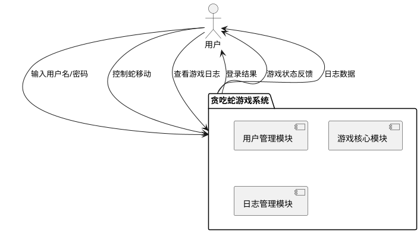
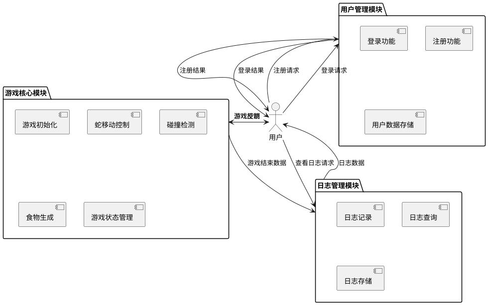
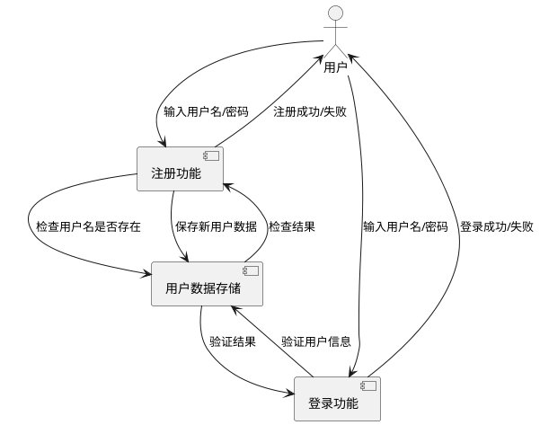
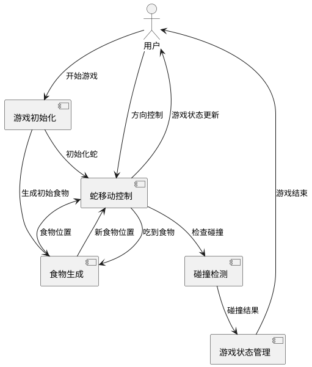
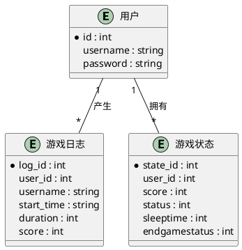
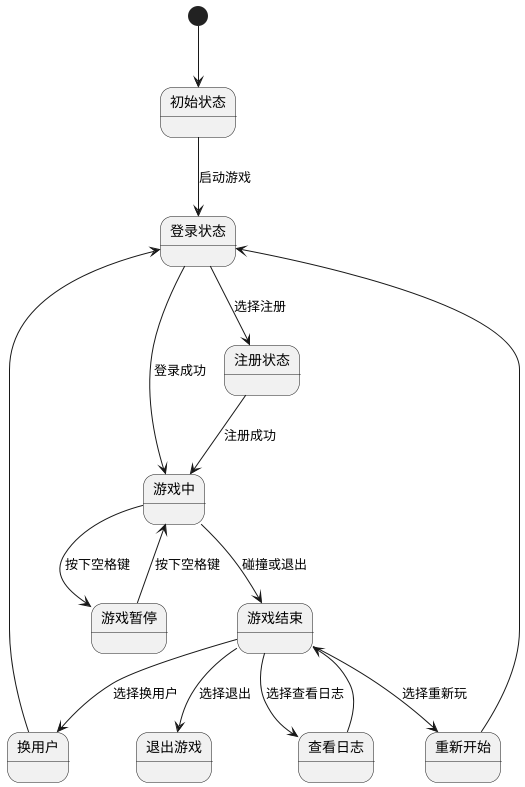
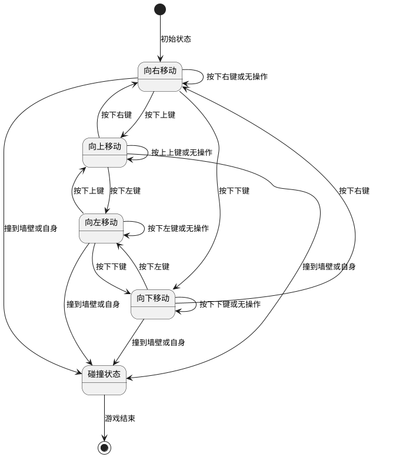

# 贪吃蛇游戏需求建模文档

## 1. 数据流图 (DFD)

### 1.1 顶层数据流图

### 1.2 第一层数据流图

### 1.3 第二层数据流图 - 用户管理模块

### 1.4 第二层数据流图 - 游戏核心模块

## 2. 数据字典

### 2.1 用户数据
| 数据元素 | 类型 | 长度 | 描述 |
|---------|------|------|------|
| id | int | 4字节 | 用户唯一标识符 |
| username | char[] | 50字节 | 用户名 |
| password | char[] | 50字节 | 用户密码 |

### 2.2 游戏日志数据
| 数据元素 | 类型 | 长度 | 描述 |
|---------|------|------|------|
| user_id | int | 4字节 | 用户ID |
| username | char[] | 50字节 | 用户名 |
| start_time | char[] | 30字节 | 游戏开始时间 |
| duration | int | 4字节 | 游戏持续时间（秒） |
| score | int | 4字节 | 游戏得分 |

### 2.3 游戏状态数据
| 数据元素 | 类型 | 长度 | 描述 |
|---------|------|------|------|
| score | int | 4字节 | 当前得分 |
| add | int | 4字节 | 每次吃食物的得分 |
| status | int | 4字节 | 蛇的移动方向 |
| sleeptime | int | 4字节 | 移动间隔时间 |
| endgamestatus | int | 4字节 | 游戏结束状态 |

### 2.4 蛇数据结构
| 数据元素 | 类型 | 长度 | 描述 |
|---------|------|------|------|
| x | int | 4字节 | 蛇节点的x坐标 |
| y | int | 4字节 | 蛇节点的y坐标 |
| next | struct* | 8字节 | 指向下一个蛇节点的指针 |

### 2.5 食物数据结构
| 数据元素 | 类型 | 长度 | 描述 |
|---------|------|------|------|
| x | int | 4字节 | 食物的x坐标 |
| y | int | 4字节 | 食物的y坐标 |

## 3. 实体联系图 (ERD)

## 4. 状态图

### 4.1 游戏状态图

### 4.2 蛇移动状态图

## 5. 需求建模意图说明

### 5.1 数据流图说明

数据流图展示了贪吃蛇游戏系统中数据的流动和处理过程，主要包括以下几个方面：

1. **用户管理模块**：处理用户的注册、登录请求，验证用户身份，并存储用户数据。
2. **游戏核心模块**：处理游戏的初始化、蛇的移动控制、碰撞检测、食物生成等核心游戏逻辑。
3. **日志管理模块**：记录用户的游戏数据，包括游戏开始时间、持续时间、得分等，并提供日志查询功能。

通过数据流图，我们可以清晰地看到系统各模块之间的数据流动关系，以及数据如何在系统中被处理和传递。

### 5.2 数据字典说明

数据字典定义了系统中使用的所有数据元素，包括用户数据、游戏日志数据、游戏状态数据、蛇数据结构和食物数据结构。每个数据元素都有明确的类型、长度和描述，确保系统中的数据被正确理解和使用。

### 5.3 实体联系图说明

实体联系图展示了系统中实体之间的关系，主要包括用户、游戏日志和游戏状态三个实体。用户可以产生多条游戏日志，也可以拥有多个游戏状态。通过实体联系图，我们可以清晰地看到系统中各实体之间的关联关系。

### 5.4 状态图说明

状态图展示了系统或对象的状态变化，主要包括游戏状态图和蛇移动状态图：

1. **游戏状态图**：展示了游戏从初始状态到登录、注册、游戏中、暂停、结束等状态的转换过程。
2. **蛇移动状态图**：展示了蛇在不同方向移动的状态转换，以及碰撞后进入游戏结束状态的过程。

通过状态图，我们可以清晰地看到系统或对象在不同条件下的状态变化，以及状态之间的转换关系。

### 5.5 整体需求建模意图

通过以上图表和说明，我们旨在：

1. **清晰理解系统结构**：通过数据流图和实体联系图，我们可以清晰地了解系统的整体结构和各模块之间的关系。
2. **明确数据需求**：通过数据字典，我们可以明确系统中需要处理的数据元素及其属性。
3. **理解状态变化**：通过状态图，我们可以理解系统或对象在不同条件下的状态变化。
4. **指导开发实现**：这些图表和说明可以作为开发人员实现系统的参考，确保系统按照需求正确实现。
5. **便于沟通和理解**：通过可视化的图表，我们可以更方便地与团队成员和用户沟通，确保大家对系统需求有一致的理解。

总之，这些需求建模文档为贪吃蛇游戏的开发提供了清晰的指导，确保系统能够按照预期实现所有功能。